# Windows平台
## 1. 软件下载
1. [msys2](https://mirrors.tuna.tsinghua.edu.cn/msys2/distrib/msys2-x86_64-latest.exe)
2. [vscode](https://code.visualstudio.com/sha/download?build=stable&os=win32-x64-user)
3. [jlink](https://www.segger.com/downloads/jlink/) -- 使用jlink调试时才下载jlink和ozone
4. [ozone](https://www.segger.com/downloads/jlink/#Ozone)
5. [git](https://mirrors.tuna.tsinghua.edu.cn/github-release/git-for-windows/git/LatestRelease/Git-2.50.1-64-bit.exe)
6. [arm-none-eabi-gcc](https://developer.arm.com/downloads/-/arm-gnu-toolchain-downloads)  
> windows的下这个(zip就行)-- 看清了是arm-none-eabi
> 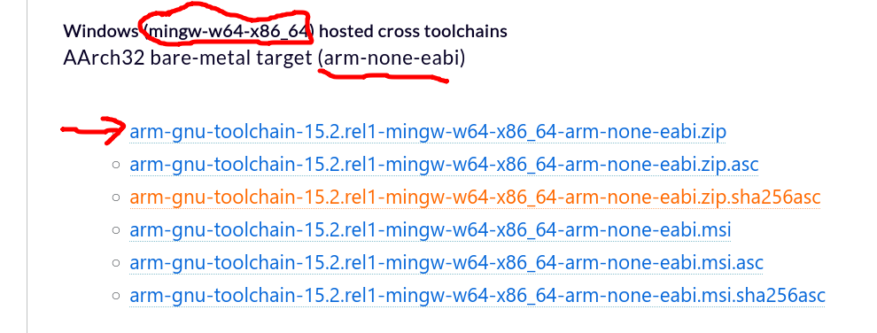
> linux的下这个(tar.xz就行)-- 看清了是arm-none-eabi
> 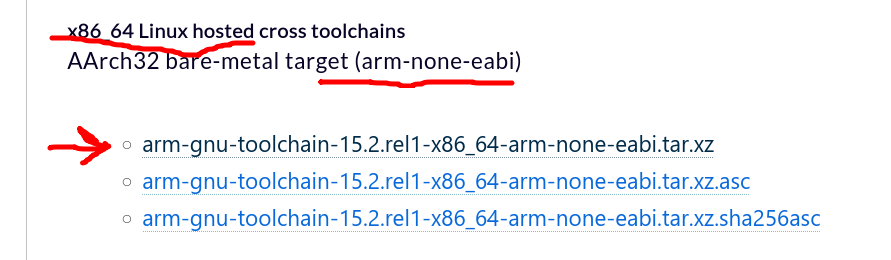

## 2. 软件安装
### 1. msys2安装
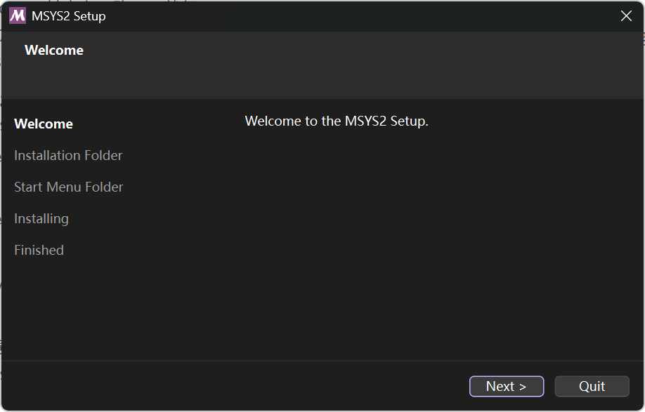
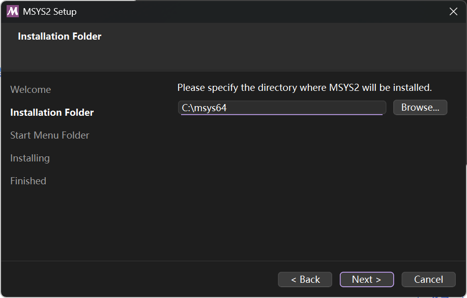
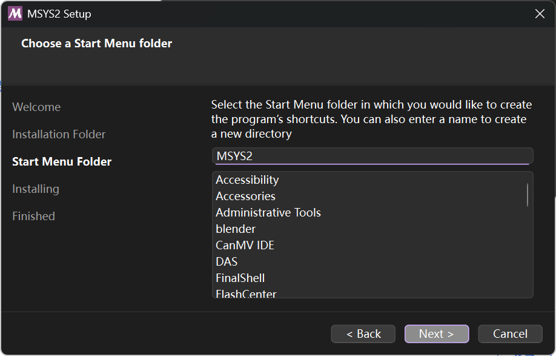
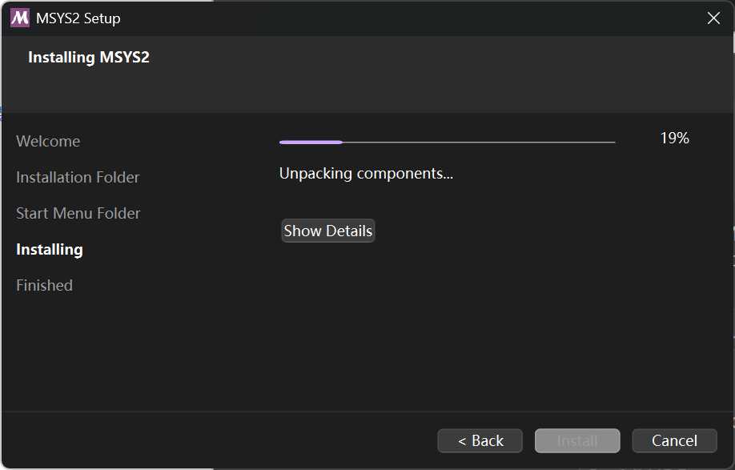
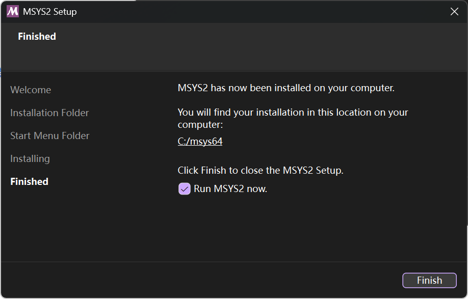
#### msys2更换源
``` bash
在 MSYS2 环境下直接运行命令替换镜像源：

sed -i "s#mirror.msys2.org/#mirrors.ustc.edu.cn/msys2/#g" /etc/pacman.d/mirrorlist*

然后执行 pacman -Sy 刷新软件包数据即可。
```

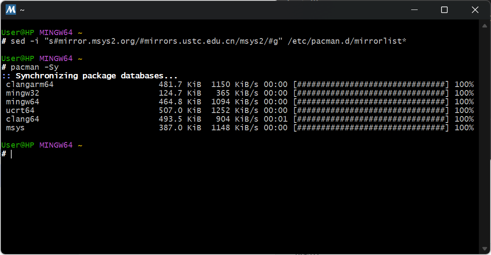

##### msys2配置环境变量
设置-系统-系统信息-高级系统设置-环境变量-path
> 添加 C:\msys64\mingw64\bin （这里是你的msys2安装路径！！！）
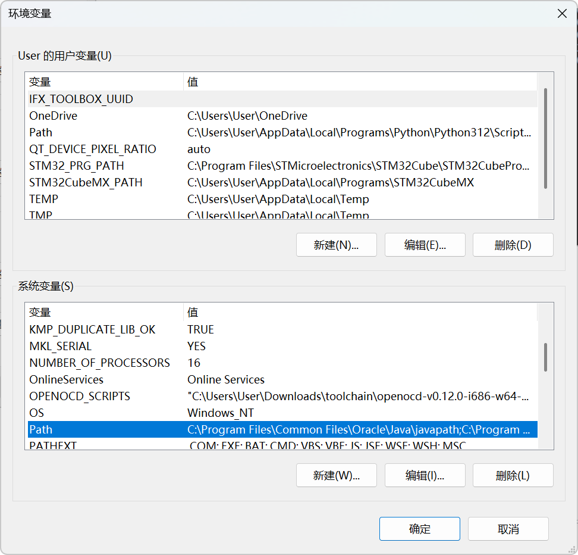
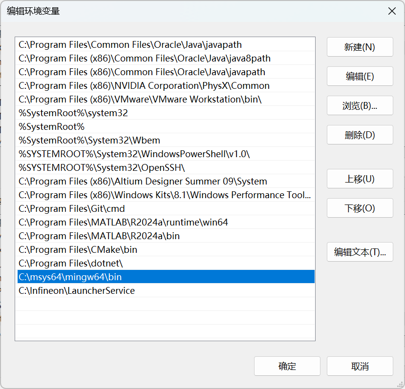

#### msys2必要组件安装
> 主要是安装arm-none-eabi-gcc工具链 cmake及ninja编译 clang代码检查 openocd烧录代码
``` bash
pacman -S mingw-w64-x86_64-toolchain mingw-w64-x86_64-arm-none-eabi-toolchain mingw-w64-x86_64-ccache mingw-w64-x86_64-cppcheck mingw-w64-x86_64-openocd mingw-w64-x86_64-ninja mingw-w64-x86_64-cmake mingw-w64-x86_64-clang-tools-extra mingw-w64-x86_64-clang
```
### arm-none-eabi-gcc安装
> 尽量全英文目录解压，并配置环境变量到path （到bin文件夹就行）
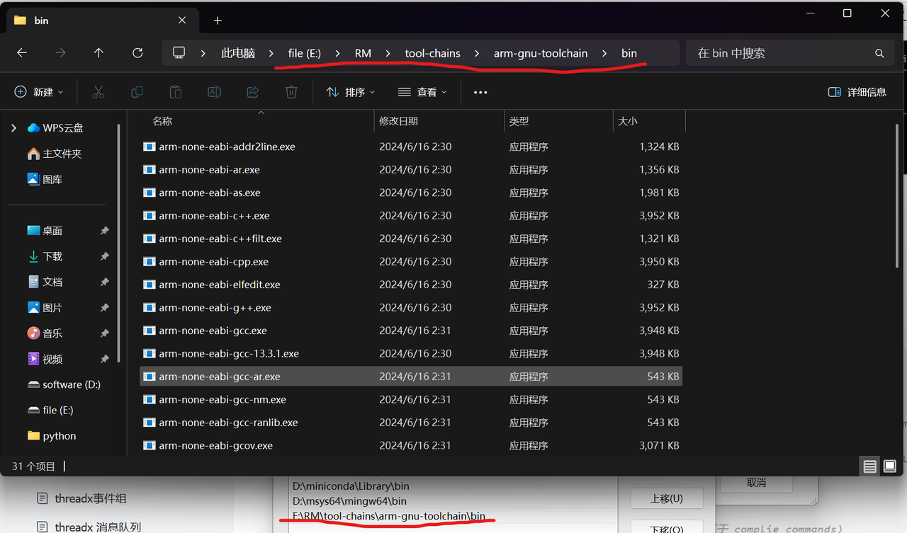

### vscode配置
> 下载如图所示插件即可，也可以下载主题和icons（例如vscode-icons）美化一下

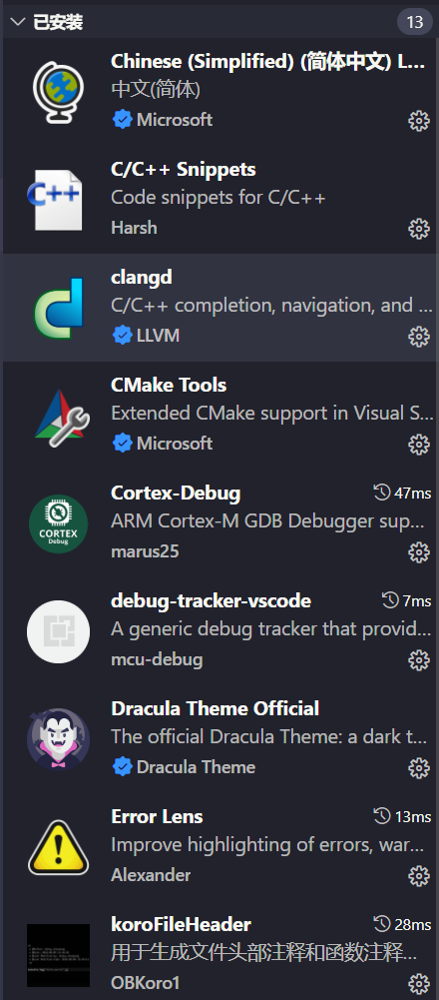

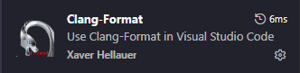

#### 插件配置
> 如何找到setting.json设置模板
> 1. 简单的输入命令
> - 打开VSCode命令面板: mac: command + p window: ctrl + p
> - 输入> Open Settings(注意>后面有一个空格)
> 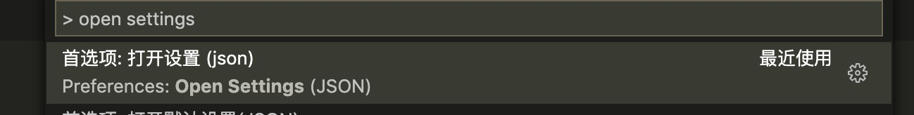

1. c/c++ snippets
> vscode中 ctrl + shift + p 调用框，在其中输入 snippets 选择配置代码片段选项，选择新建全局代码片段
> 命名为header回车，将下述代码粘贴
``` json
"C C++ Header": {
        "scope": "c, cpp",
        "prefix": "header",
        "description": "Add #ifndef, #define and #endif",
        "body": [
            "#ifndef _${TM_FILENAME_BASE/(.*)/${1:/upcase}/}_H_",
            "#define _${TM_FILENAME_BASE/(.*)/${1:/upcase}/}_H_",
            "",
            "$0",
            "",
            "#endif // _${TM_FILENAME_BASE/(.*)/${1:/upcase}/}_H_"
        ]
    }
```
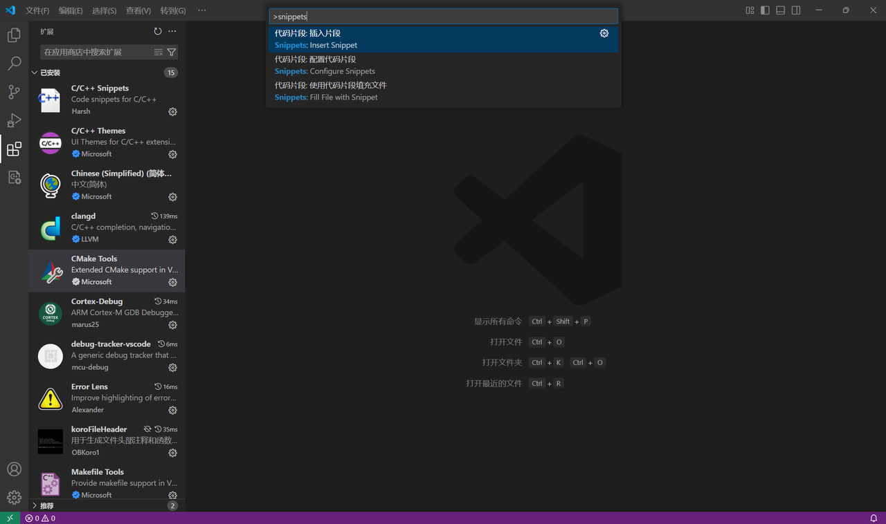
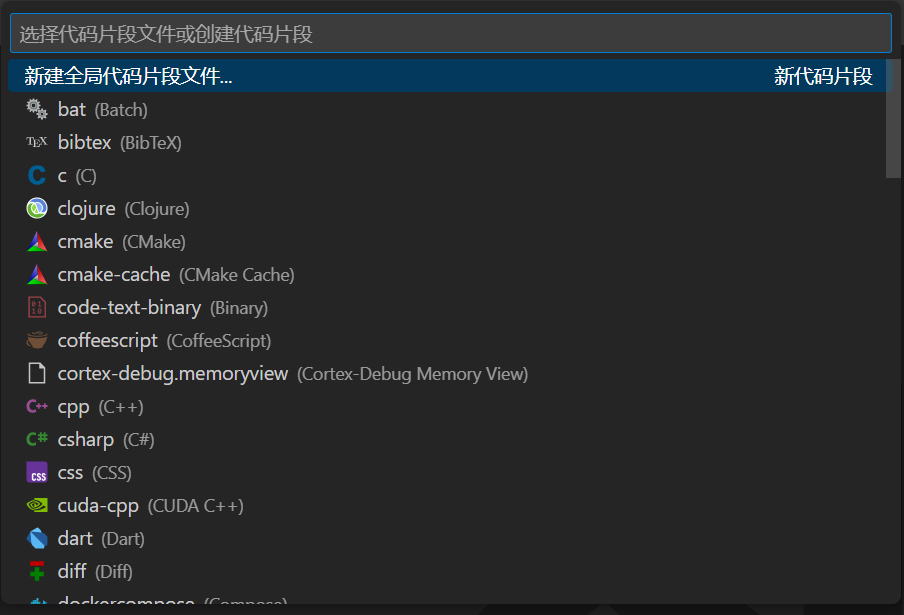

2. Korofileheader
``` json
    // 头部注释
    "fileheader.customMade": {
        // Author字段是文件的创建者 可以在specialOptions中更改特殊属性
        // 公司项目和个人项目可以配置不同的用户名与邮箱 搜索: gitconfig includeIf  比如: https://ayase.moe/2021/03/09/customized-git-config/
        // 自动提取当前git config中的: 用户名、邮箱
        "Author": "git config user.name && git config user.email", // 同时获取用户名与邮箱
        // "Author": "git config user.name", // 仅获取用户名
        // "Author": "git config user.email", // 仅获取邮箱
        // "Author": "OBKoro1", // 写死的固定值 不从git config中获取
        "Date": "Do not edit", // 文件创建时间(不变)
        // LastEditors、LastEditTime、FilePath将会自动更新 如果觉得时间更新的太频繁可以使用throttleTime(默认为1分钟)配置更改更新时间。
        "LastEditors": "git config user.name && git config user.email", // 文件最后编辑者 与Author字段一致
        // 由于编辑文件就会变更最后编辑时间，多人协作中合并的时候会导致merge
        // 可以将时间颗粒度改为周、或者月，这样冲突就减少很多。搜索变更时间格式: dateFormat
        "LastEditTime": "Do not edit", // 文件最后编辑时间
        // 输出相对路径，类似: /文件夹名称/src/index.js
        "FilePath": "Do not edit", // 文件在项目中的相对路径 自动更新
        // 插件会自动将光标移动到Description选项中 方便输入 Description字段可以在specialOptions更改
        "Description": "", // 介绍文件的作用、文件的入参、出参。
        // custom_string_obkoro1~custom_string_obkoro100都可以输出自定义信息
        // 可以设置多条自定义信息 设置个性签名、留下QQ、微信联系方式、输入空行等
        //"custom_string_obkoro1": "", 
        // 版权声明 保留文件所有权利 自动替换年份 获取git配置的用户名和邮箱
        // 版权声明获取git配置, 与Author字段一致: ${git_name} ${git_email} ${git_name_email}
        //"custom_string_obkoro1_copyright": "Copyright (c) ${now_year} by ${git_name_email}, All Rights Reserved. "
        // "custom_string_obkoro1_copyright": "Copyright (c) ${now_year} by 写死的公司名/用户名, All Rights Reserved. "
    },
    // 函数注释
    "fileheader.cursorMode": {
        "description": "", // 函数注释生成之后，光标移动到这里
        "param": "", // param 开启函数参数自动提取 需要将光标放在函数行或者函数上方的空白行
        "return": "",
    }
```
> 这里函数注释和头部注释，通过快捷键触发，可能有快捷键冲突情况，在
设置-键盘快捷方式-然后键入koro，将cursorTip，fileheader 对应的快捷键修改成自己习惯用的

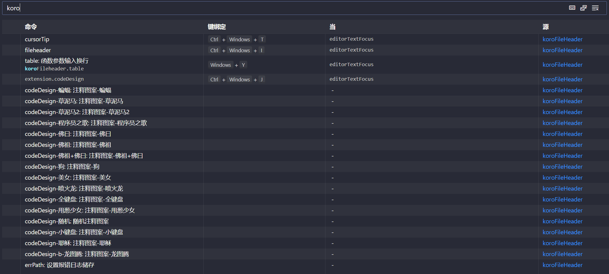

3. Clang-format

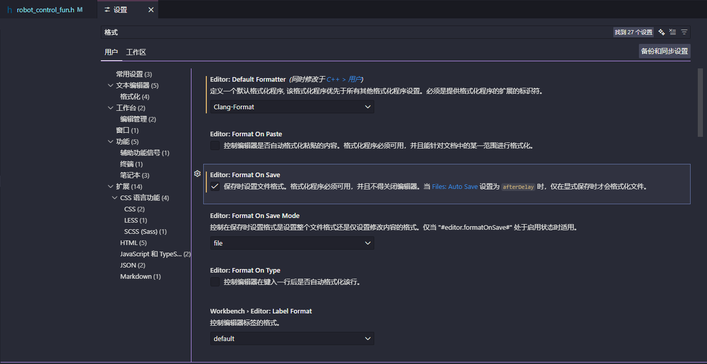

# Linux 平台

## 1. 安装基础依赖
``` bash
sudo apt update
sudo apt install git cmake ninja-build openocd ccache cppcheck clang-format clangd
```

> 使用 ARM 官方工具链保持与 CI 一致。
> vscode/jlink/ozone 按需安装，配置方法与 Windows 相同。

## 2. 安装 ARM 官方工具链（arm-none-eabi-gcc）

从 [ARM 官方下载页](https://developer.arm.com/downloads/-/arm-gnu-toolchain-downloads) 下载
**AArch32 bare-metal target (arm-none-eabi)** 的 **tar.xz** 包（看清了是 arm-none-eabi，如图）：


解压到任意目录（建议路径不含中文/空格），并将 bin 目录加入 PATH：
``` bash
# 解压（示例路径，按实际版本修改）
mkdir -p ~/toolchains
tar -xf arm-gnu-toolchain-*-x86_64-arm-none-eabi.tar.xz -C ~/toolchains

# 加入 PATH（以 bash 为例，zsh 写入 ~/.zshrc）
echo 'export PATH=$HOME/toolchains/arm-gnu-toolchain-*-x86_64-arm-none-eabi/bin:$PATH' >> ~/.bashrc
source ~/.bashrc

# 验证
arm-none-eabi-gcc --version
```

## 3. 构建验证
``` bash
cd mas_embedded_threadx
cmake --preset Debug -DBOARD=damiao_h7 -DROBOT=infantry3 -DBOARD_MODE=single
cmake --build --preset Debug
```

配置时若检测到 `cppcheck` 会自动启用；静态检查并生成日志报告：
``` bash
cmake --build build/damiao_h7/Debug --target cppcheck-log
# 报告：build/damiao_h7/Debug/cppcheck/cppcheck.log
```
> 烧录需要 udev 规则或用户组权限，若 OpenOCD 提示无法访问设备：
> `sudo usermod -aG plugdev $USER` 后重新登录。
